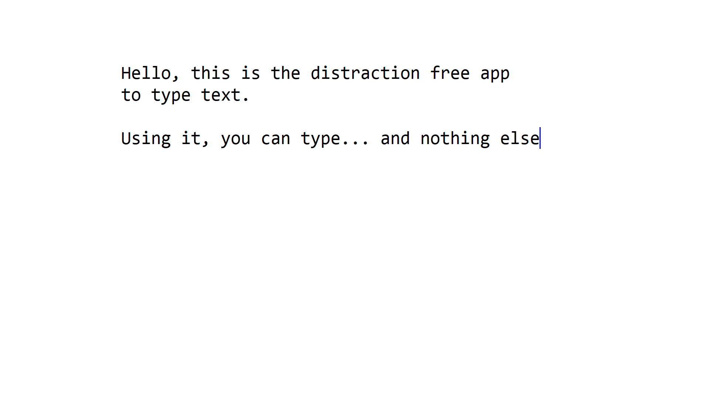

# Focus Empty Space Writer

A distraction-free writing environment built with Python and customtkinter.



## Features

- Clean, minimalist interface
- Customizable margins
- Font size and family controls
- Markdown support
- Fullscreen mode
- Keyboard shortcuts for quick access to features

## Keyboard Shortcuts

| Action | Shortcut |
|--------|----------|
| Open File | `Ctrl + O` |
| Save File | `Ctrl + S` |
| Toggle Fullscreen | `Escape` |
| Increase Font Size | `Ctrl + ]` |
| Decrease Font Size | `Ctrl + [` |
| Increase Top Margin | `Ctrl + J` |
| Decrease Top Margin | `Ctrl + K` |
| Increase Left Margin | `Ctrl + L` |
| Decrease Left Margin | `Ctrl + H` |

## Installation

1. Clone the repository
2. Install dependencies:
   ```bash
   poetry install
   ```

## Usage

You can run the application in two ways:

1. Using Poetry:
   ```bash
   poetry run focus-emty-space-writer
   ```

2. Running the Python file directly:
   ```bash
   poetry run python src/main.py
   ```

## Building

To build the application for your platform:

  ```bash
  make build
  ```


## Development

The project uses Poetry for dependency management. Make sure you have Poetry installed before contributing.

## License

This project is licensed under the MIT License - see the LICENSE file for details.
